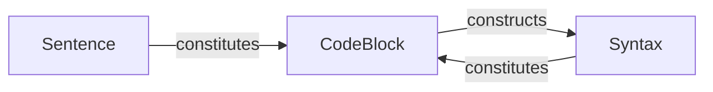

# Design of Semantic Parsers

This document contains a top-down overview of the design for the entire semantic parser system, used in MkData. You will find a detailed explanation of all source files in the `src/` directory, and how they interact with each other.

## Overview

There are 11 files in the `src/` directory. Three of them begin with underscores.

- `_base.py`: This file includes all base classes used in this project. That these classes are extracted into this file is to avoid circular imports.
- `_utils.py`: This file includes utility functions used across different files which are not specific to the project.
- `_env.py`: This file provides the dictionary that is used to track the environment of the interpreter sandbox.

The rest of the files can be divided into several layers:

Layer 1: Providing basic semantic and execution functionality:
- `execute.py`: This file includes functions that immediately parse and execute a string of code.
- `parse.py`: This file includes auxiliary classes and functions that partitions scripts according to brackets and indentations.

Layer 2: Wrapping semantic execution in classes that contain the execute function:
- `sentence.py`: This contains the interface that runs a single sentence (ie. line of gen code).
- `code_block.py`: Extends sentence.py. Defines a collection of executables.
- `syntax.py`: Extends code_block.py. Executes a section of code blocks using syntax rules.

Layer 3: Providing the interface for the user to interact with the parser:
- `interpreter.py`: This file includes the main class that the user interacts with. It provides the `run` function that runs a script.

Misc:
- `preimport.py`: This sets up the environment for the script managed by the interpreter. This is a preparation step before running the script.

Entry point:
- `mkdata`: This is the executable file that the user runs to start the interpreter. When the system is ready for publishing, it will be set as the entrypoint for the module, an executable that the user can call after installing the package via pip.

## Workflow

Here is what happens when the user submits a script for mkdata to run:

1. `mkdata` parses the script, then creates an `Interpreter` instance.
2. The `run()` function is called on the interpreter. The interpreter scans the script, handling \@redirect, until it finds the \@run syntax, and enters the execution zone.
3. A full string of the execution zone is provided to a SyntaxRun class, initializing an instance. This phase is called **the compile phase**. Recursively, `parser.py` provides partitions to the script, and instances of `CodeBlock` and other `Syntax` subclasses are initialized. The result is a chain of executables in each instance, called **the execution chain** corresponding to the given script.

4. After the compiling phase, the instance of the `SyntaxRun` class becomes the starting point of the execution chain, and the `execute()` function on it. Recursively, all the `execute()` functions are called on the execution chain, and the script is executed. The results are immediately printed to the specified output stream. In this process, the environment defined within _env.py constantly changes to mirror the context of the script.
